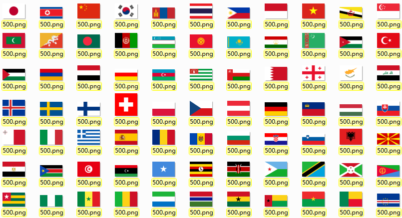

## 资源

    将自己开发时收集到的资源放到这里，方便有需要的人拿去用。

### 教育

1. **[国旗](flags.zip)**

    包含200多个国家的国旗图片及声音，图片的格式有2种（png,svg），PNG有5个尺寸（100,200,500,1000,2000），声音是mp3格式。

2. **[284个一年级常用汉字和语音](ChineseCharacter/284_commonly_used_chinese_characters_and_voice.zip)

    《幼儿画报》发表统计报告，称在教育审定的12种小学一年级教材中，284个常用字的出现频率高达58.79%，据此推荐家长让孩子优先学习这284个字 早期阅读就是早期的文学作品教育。

    爱 八 巴 把 爸 白 伴 北 笔 边 变 别 不 步 才 草 长 车 成 吃 池 虫 出 处 吹 春 从 答 打 大 带 到 道 得 的 灯 地 点 东 冬 动 都 对 多 朵 儿 耳 二 发 方 放 飞 分 风 干 高 告 歌 个 给 跟 瓜 光 国 果 过 孩 海 好 禾 和 河 很 红 后 候 花 画 话 欢 还 黄 回 会 活 火 己 家 间 见 江 角 叫 节 姐 界 金 进 睛 九 就 觉 开 看 棵 可 空 口 快 来 蓝 老 乐 里 力 立 亮 了 林 流 柳 六 绿 妈 马 满 毛 么 没 每 美 门 们 米 面 苗 明 母 木 那 奶 南 你 年 鸟 牛 女 跑 朋 皮 片 七 奇 起 气 千 前 青 清 请 秋 去 全 让 热 人 日 入 三 色 森 沙 山 上 少 生 声 师 十 什 石 时 世 事 是 手 书 树 数 水 说 四 松 送 岁 他 她 它 台 太 桃 天 田 条 跳 听 同 头 土 兔 完 玩 晚 为 位 问 我 乌 五 小 笑 写 心 新 兴 星 行 许 学 雪 西 习 下 想 向 像 鸭 牙 眼 阳 要 爷 也 叶 夜 一 衣 用 友 有 又 鱼 雨 园 原 圆 月 云 再 在 早 找 这 真 正 枝 知 只 纸 中 种 竹 住 捉 着 子 字 自 总 走 足 最 坐 做

